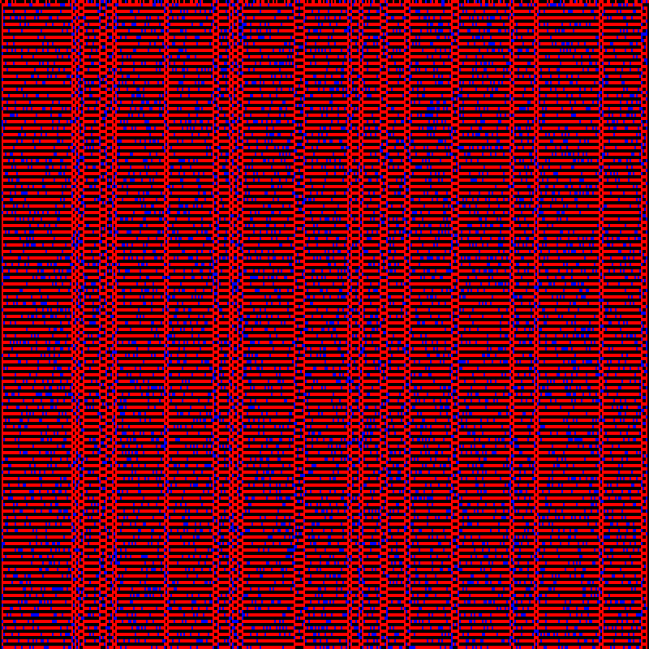

# Part 2: Cellular Automata

We will use Wolfram's Cellular Automata to produce complex patterns based on a simple algorithm. 

This script produces 256 possible patterns. A complete overview can be found [here](http://mathworld.wolfram.com/ElementaryCellularAutomaton.html).

But we will go a bit further to produce stuff like this

## Further reading & ressources
We don't have the time to cover the full code in the workshop. But if someone is interested in learning how to write such a code I can recommend you the following resources: 

* [Cellular Automata Video Tutorial](https://www.youtube.com/watch?v=DKGodqDs9sA&list=PLRqwX-V7Uu6YrWXvEQFOGbCt6cX83Xunm)
* [Daniel Shiffman, The Nature of Code, Chapter 7., Cellular Automata](https://natureofcode.com/book/chapter-7-cellular-automata/)