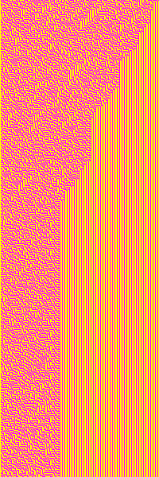
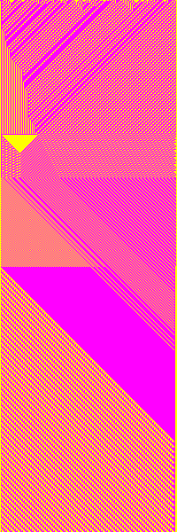
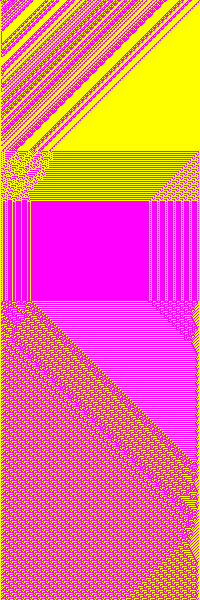
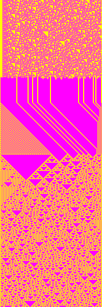

# Wolfram CA Workshop Sketch Extended 2
This sketch has a dimension of 200 x 600 px and safes .TIF files. A width of 200 px is required if you want to knit your patterns later in the workshop. The exported .TIF files must be converted into .BMP files.

The sketch also has a added possibility of changing the CA rule over time.

 
 
 
 