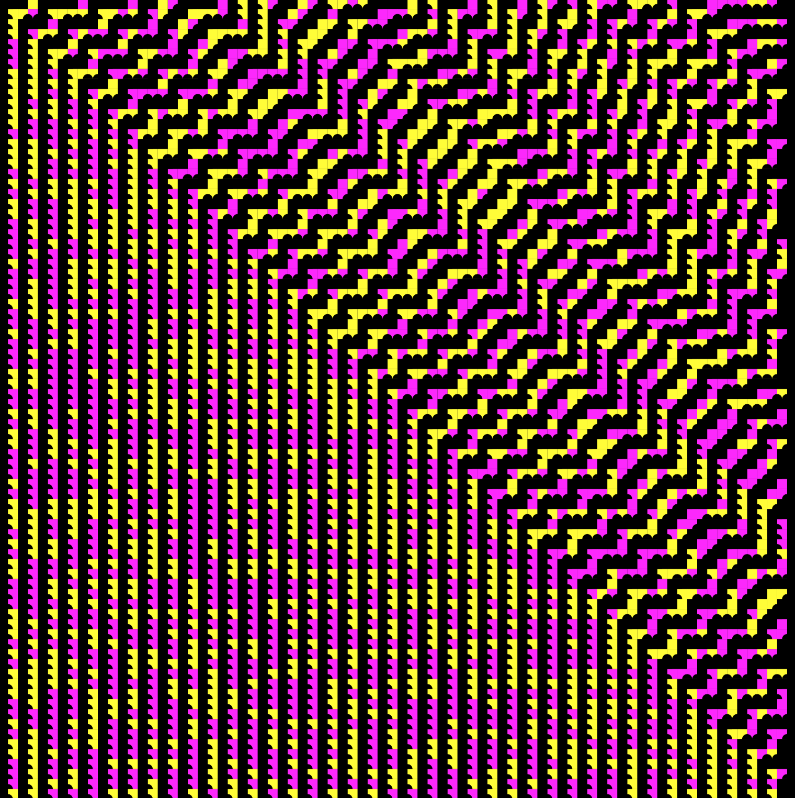

# 00001111

# Wolfram CA Regionale 2019
Sketch for the Regionale 2019 exhibition.
Includes special export functionality for printable files.

Version 1:
Include `beginRecord(PDF, "everything.pdf");` in `void setup()`, hit `q` to quit & save the pdf. This records one single file with everything.

Verion 2:
Include `beginRecord(PDF, "frame-####.pdf");` in `void mousePressed()`, hit `q` to quit & save the pdf. This creates a new file on every `mousePressed` event. There is a bug that the forms in the pdf get a stroke. 
