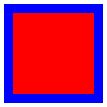

# 0/1 – Black/White – On/Off – Dead/Alive
«Weaving Scripting Writing», Scripting Workshop, ETH Architecture, Seminar Week, 17–22 March 2019.

## Introduction to scripting

We will use the Processing software for our first steps into the world of scripting and coding. It was developed by Ben Fry and Casey Reas at the MIT. The software is a flexible tool to learn how to code in the context of the visual arts.

First things first: [Download Processing](https://code.visualstudio.com/) 


### 0. setup & draw:

The function `setup` will be execute once at the beginning. Here you define your sketch size.

```
void setup(){
  size(800, 800);
}
```

The `draw` function is a loop, executing 60 times per second. This is very helpfull to keep your sketch up to date. It enables motion and interactivitiy. 

```
void draw(){
  //crazy things happening here
}
```
It's also possible to work without a `draw` function. This way your program just get's executed once.

### 1. Comments:

You can activate / deactive code by commenting / uncommenting it with `//`

```
rect(0, 0, 200, 200); // get's executed
// ellipse(0, 0, 100, 100); // get's not executed

```

### 2. Coordinate system and unit of measurement:

In Processing you work with a `x` (horizontal) and `y` (vertical) axis. The unit of measurement is pixel.

```
size(720, 400); // sketch is 720 x 400 px
```

### 3. Primitiv shapes
There are different shapes predefined. Including rectangles, circles, triangles and more. [For a full reference visit the Processing website](https://processing.org/examples/shapeprimitives.html). Depending on there shape they take different arguments:

```
rect(x, y, width, height);
ellipse(x, y, width, height);
line(x1, y1, x2, y2)
triangle(x1, y1, x2, y2, x3, y3)
```

### 4. Color

Processing uses the RGB color mode by default. Therefore every color needs 3 arguments: `(red, green, blue)`. These values range from 0 to 255. If you only write one argument it will result in a grayscale tone. [For a full reference check here](https://processing.org/reference/colorMode_.html) 

```
fill(0) // black
fill(255) // white
fill(120) // some gray
fill(255, 0, 0) // red
fill(0, 255, 0) // green
fill(0, 0, 255) // blue
``` 
You can also define stroke color and strokeweight. If you don't want a stroke write: `noStroke();`

```
fill(255, 0, 0);
stroke(0, 0, 255);
strokeWeight(5);
rect(0, 0, 50, 50);
```
The code above results in: 



### 5. Variables

To be more flexible you can use variables. They are a key concept of almost every programming language. 

```
int myVariable; // declare a variable
int size = 100; // declare a variable and assign a value of 100
```
Now you can use this variable (and it's value) in the code: `rect(0, 0, size, size);` Awesome! 🎉

There are also built in variables like `mouseX`, `mouseY` as well as `width` and `height` of your sketch. 

### 6. Datatypes

When you define a variable you also have to think about it's datatype. It's what? Datatype? Yeah right! You can work with these types:

```
int a = 0; // A round number 'int'
float b = 0.0; // A decimal number 'float'
String words = "Hello World"; // Words 'string'
boolean c = false; // true or false 'boolean'

```
One of the most important data types is the `array`. An array is a list of data. Each piece of data in an array is identified by an index number representing its position in the array. Arrays are zero based, which means that the first element in the array is [0], the second element is [1], and so on.

```
float[] myArray; // empty array of the type 'float'
int[] myArray2 = { 2, 4, 6, 10, 16, 26, 42, 68}; // array of the type 'int'
```

You can access your arrays values by adding the index number like this:

```
myArray2[0] // equals 2
myArray2[3] // equals 10

```

Yeah, the array is a weird thing! 🔮 But practically every data out in the web (e.g. your facebook likes) is saved as array data type.

### 7. Console

You can output data in the console to see problems in the code by writting `println(myVariable or value)`. The console is **super helpfull**, never underestimate the power of the console 💪.

### 8. For loop

If you want to handle many similar things at once, the "for loop" is the weapon of choice. `int i` is a counter which usually starts at `0`. As long as `i` is smaller than `100` the code inside the `{}` gets executed. `i = i + 1` indicates how big the counting steps are.

```
for (int i = 0; i < 100; i = i + 1) {
  rect(0, 0, 100, 100);
}
```
This code draws 100 rectangles on the same position. Cool but useless, right? Keep reading!

### 9. Random

Usually you need a bit of random to make you code spicy 🔥. This outputs a random number between 0 and 100: `random(0, 100);`. Trough this the code from above makes much more sense:

```
for (int i = 0; i < 100; i = i + 1) {
  float x = random(0, width);
  float y = random(0, height);
  rect(x, y, 100, 100);
}
```
Attention! 🚧 the `random` function returns a `float` (decimal number). If you want a `int` you have to round the decimal number like this: `int(random(0, 200));` 

### 10. JPG Export

You did some awesome stuff? Then you probably want to export it, right? 
First add this to the top of your sketch. Through this you can access your computers calendar (time) functions.

```
import java.util.Calendar;
```
Copy this code and at the bottomof your sketch, outside any other function. Now press `s` on the keyboard to save a PNG file.

```
void keyReleased() {
  if (key == 's' || key == 'S') saveFrame("frames/"+timestamp()+"_##.png");
  println("safed");
}

String timestamp() {
  Calendar now = Calendar.getInstance();
  return String.format("%1$ty%1$tm%1$td_%1$tH%1$tM%1$tS", now);
}

```

## Outlook
I can encourage you to check out the following resources:

[Hello Processing!](https://hello.processing.org/editor/)

[Daniel Shiffman - creative coding guru](https://shiffman.net/)

[Learn more from the Processing website!](https://processing.org/tutorials/)

[Official Processing Forum](https://discourse.processing.org/)

[Tons of examples by Generative Gestaltung](http://www.generative-gestaltung.de/1/)
